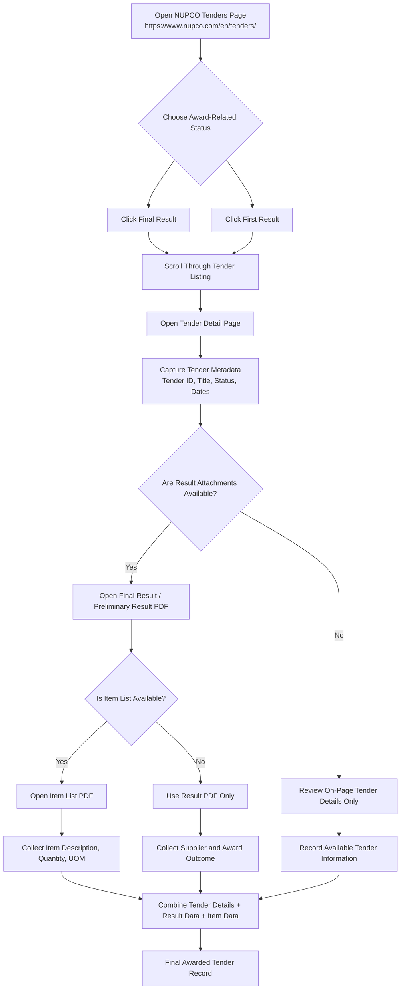

# NUPCO Website Flow Chart

```mermaid
flowchart TD
    A[Open NUPCO Tenders Page<br/>https://www.nupco.com/en/tenders/] --> B{Choose Award-Related Status}
    B --> C[Click Final Result]
    B --> D[Click First Result]
    C --> E[Scroll Through Tender Listing]
    D --> E
    E --> F[Open Tender Detail Page]
    F --> G[Capture Tender Metadata<br/>Tender ID, Title, Status, Dates]
    G --> H{Are Result Attachments Available?}
    H -->|Yes| I[Open Final Result / Preliminary Result PDF]
    H -->|No| J[Review On-Page Tender Details Only]
    I --> K{Is Item List Available?}
    K -->|Yes| L[Open Item List PDF]
    K -->|No| M[Use Result PDF Only]
    L --> N[Collect Item Description, Quantity, UOM]
    M --> O[Collect Supplier and Award Outcome]
    J --> P[Record Available Tender Information]
    N --> Q[Combine Tender Details + Result Data + Item Data]
    O --> Q
    P --> Q
    Q --> R[Final Awarded Tender Record]
```
